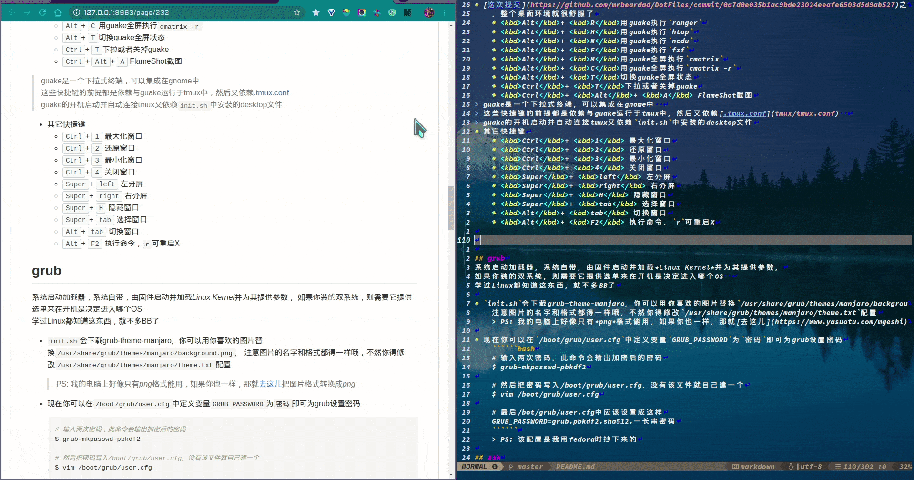

* * *

# 目录
<!-- vim-markdown-toc GFM -->

- [笔记](#笔记)
- [安装](#安装)
- [详细](#详细)
  - [gnome dconf](#gnome-dconf)
  - [grub](#grub)
  - [ssh](#ssh)
  - [zsh](#zsh)
  - [tmux](#tmux)
  - [alacritty](#alacritty)
  - [xfce4-terminal](#xfce4-terminal)
  - [gdb](#gdb)
  - [chfs](#chfs)
  - [prime](#prime)
  - [rime](#rime)
  - [neovim](#neovim)

<!-- vim-markdown-toc -->
* * *

# 笔记
在此推荐一个作笔记的方法：用手机作笔记🙈️  
不是开玩笑的，因为手机的屏幕就只有那么大，我为了让笔记内容能整齐的容纳在一行之中，
会修改很多很多次，精简精简再精简，这也是个自省和知识提炼的过程，在转移到电脑上来进行整理和扩充.  
你要没点强迫症。。。那没事了
* [学习资源](notes/learning-resource.md)
    > \[注]:该笔记很久没更新了，不过基础知识应该不会过期嘛  
    > 就怕连接过期了:joy:
* [linux基础](cheat/linux.md)
    > \[注]:包括许多基础命令与概念
* [Linux启动流程](cheat/boot.md)
* [Bash](cheat/bash.md)
    > \[注]:除了语法外，还有一些流处理命令，如:`awk` `sed`等
* [ANSI终端颜色](cheat/ansi.md)
* [开发工具](cheat/devtool.md)
    > \[注]:包括gcc, gdb, git等
* [Vim](cheat/vim.md)
* [Markdown概念](cheat/markdown.md)
* [小鹤双拼](cheat/double_pinyin.md)
* [Manjaro安装](notes/manjaro.md)
* [C++标准库](cheat/cppman.md)
    > \[注]:该笔记为了终端查询可读性更好，并未遵守markdown语法，
    > 毕竟代码里有很多`<>` `*` `_`
* [C++语法特性](notes/cpp.md)
* [比特币与区块链](notes/bitcoin.md)
* [深入了解计算机系统](notes/csapp.md)
* [编程技巧&数据结构与算法](notes/dsaa.md)

**注：仓库中bin/{see,say}两个命令用于终端快速查阅笔记与修改笔记，`see -h ; say -h`了解详情**  
笔记位于`~/.cheat/*.md`，一级列表开头到`<!-- -->`结束为一条entry  
欢迎大家一起贡献一波cheat-sheet呀:smile:


# 安装
> 提供了shell脚本用于安装配置，**得[Manjaro20](manjaro.org)才得行哦**，不然的话照着[init.sh](init.sh)也可以非常容易的安装

1. 首先进入克隆的本仓库目录
```shell
$ cd DotFiles
```
2. 然后执行
```shell
$ ./init.sh
```

# 详细
**[init.sh](init.sh)脚本中已经写了非常详细的注释，可以直接打开看看修改了那些内容，不懂*bash语法*也无关系哦**

**所以接下来介绍的主要是如何使用整个开发环境：**
* 为什么需要这个工具
* 怎么使用这个工具

## gnome dconf
默认会直接把我的gnome桌面的整个环境配置装上去，执行完脚本后**logout**再**login**即可生效。  
这样就不用每次重装都要打开**settings**和**tweaks**还有**extensions**然后点击各种按钮再配置一遍。
> Ps: 我用的背景图片你多半是没有的，所以重登的时候你的桌面背景是黢黑的 :grin:
* [这次提交](https://github.com/mrbeardad/DotFiles/commit/0a7d0e035b1ac9bde23024eeafe6503d5d9ab527)之后
    ，整个桌面环境就很舒服了
    * <kbd>Alt</kbd>+ <kbd>R</kbd>用guake执行`ranger`
    * <kbd>Alt</kbd>+ <kbd>H</kbd>用guake执行`htop`
    * <kbd>Alt</kbd>+ <kbd>N</kbd>用guake执行`ncdu`
    * <kbd>Alt</kbd>+ <kbd>F</kbd>用guake执行`fzf`
    * <kbd>Alt</kbd>+ <kbd>M</kbd>用guake全屏执行`cmatrix`
    * <kbd>Alt</kbd>+ <kbd>C</kbd>用guake全屏执行`cmatrix -r`
    * <kbd>Alt</kbd>+ <kbd>T</kbd>切换guake全屏状态
    * <kbd>Ctrl</kbd>+ <kbd>T</kbd>下拉或者关掉guake
    * <kbd>Ctrl</kbd>+ <kbd>Alt</kbd>+ <kbd>A</kbd> FlameShot截图
>

guake是一个下拉式终端，可以集成在gnome中  
这些快捷键的前提都是依赖与guake运行于tmux中，然后又依赖[.tmux.conf](tmux/tmux.conf)  
guake的开机启动并自动连接tmux又依赖`init.sh`中安装的desktop文件
* 其它快捷键
    * <kbd>Ctrl</kbd>+ <kbd>1</kbd> 最大化窗口
    * <kbd>Ctrl</kbd>+ <kbd>2</kbd> 还原窗口
    * <kbd>Ctrl</kbd>+ <kbd>3</kbd> 最小化窗口
    * <kbd>Ctrl</kbd>+ <kbd>4</kbd> 关闭窗口
    * <kbd>Super</kbd>+ <kbd>left</kbd> 左分屏
    * <kbd>Super</kbd>+ <kbd>right</kbd> 右分屏
    * <kbd>Super</kbd>+ <kbd>H</kbd> 隐藏窗口
    * <kbd>Super</kbd>+ <kbd>tab</kbd> 选择窗口
    * <kbd>Alt</kbd>+ <kbd>tab</kbd> 切换窗口
    * <kbd>Alt</kbd>+ <kbd>F2</kbd> 执行命令，`r`可重启X

> <kbd>Alt</kbd>+ <kbd>M</kbd>开启矩阵革命 :smirk:



> <kbd>Alt</kbd>+ <kbd>C</kbd>就是🌈️雨的屏保啦

## grub
系统启动加载器，系统自带，由固件启动并加载*Linux Kernel*并为其提供参数，
如果你装的双系统，则需要它提供选单来在开机是决定进入哪个OS  
学过Linux都知道这东西，就不多BB了

* `init.sh`会下载grub-theme-manjaro，你可以用你喜欢的图片替换`/usr/share/grub/themes/manjaro/background.png`，
    注意图片的名字和格式都得一样哦，不然你得修改`/usr/share/grub/themes/manjaro/theme.txt`配置
    > PS: 我的电脑上好像只有*png*格式能用，如果你也一样，那就[去这儿](https://www.yasuotu.com/mgeshi)把图片格式转换成*png*

* 现在你可以在`/boot/grub/user.cfg`中定义变量`GRUB_PASSWORD`为`密码`即可为grub设置密码
    ``````bash
    # 输入两次密码，此命令会输出加密后的密码
    $ grub-mkpasswd-pbkdf2

    # 然后把密码写入/boot/grub/user.cfg，没有该文件就自己建一个
    $ vim /boot/grub/user.cfg

    # 最后/bot/grub/user.cfg中应该设置成这样
    GRUB_PASSWORD=grub.pbkdf2.sha512.一长串密码
    ``````
    > PS: 该配置是我用fedora时抄下来的

## ssh
安全外壳协议，OpenSSH是它的一个实现。  
有了它你就可以安全、方便地远程连接你的主机，连上后取得你的shell，就像在本地登录一样。  
它通过[非对称加密技术](https://github.com/mrbeardad/DotFiles/blob/master/notes/bitcoin.md#%E9%9D%9E%E5%AF%B9%E7%A7%B0%E5%8A%A0%E5%AF%86%E6%8A%80%E6%9C%AF)为你和主机之间建立安全隧道，故**公私钥对**是必不可少的  
> PS: 当然你可以使用你的用户密码登录，如果你的主机暴露在互联网中那当然是不推荐的。
* 提供`~/.ssh/ssh_config`，用于git通过ssh协议链接github与gitee
    > 这个你得自己把`ssh/ssh_config`复制到你的`~/.ssh`下，因为这是我自己的配置，
    > 你得自己创建**公私钥对**才能用，若不知道可以google，也可以用命令`$ see ssh`查看
* 提供`/etc/ssh/sshd_config`，用于手机ssh链接电脑，端口改为50000
    > 本来想设置只允许密钥链接的，结果我手机上用的**JuiceSSH**，它生成的公钥电脑上无法识别，
    > 电脑上生成的私钥它又无法识别。要是有万能的网友朋友知道，提个issue呀:smile:

> 现在会安装`/etc/hosts`文件，手动解析github的域名，访问更快速

## zsh
代替**bash**，强有力的生产工具，当然写脚本还是得用bash  
相较与bash，zsh主要的有点是**好看**与**好用**
* 好看  
    上图！
    
    * 很奈斯的提示符吧，从左到右分别是：用户名，时间，当前目录，git分支，git状态  
    * 用户名前面会出现3种符号：
        * `✘`表示上个命令返回非零
        * `⚙`表示后台有作业
        * `⚡`表示正以root控制zsh
    * 其中git状态：
        * 背景为黄色代表目录不干净，反之则为绿色
        * `master`代表分支名
        * `⬍`表示工作区相对暂存区有变更，`⥥` 表示暂存区待提交
    > PS: **语法高亮**与**自动命令推荐**这两款插件如今manjaro-20已经默认安装
* 好用
    * <kbd>Esc</kbd>或<kbd>Ctrl</kbd>+<kbd>\[</kbd>：进入vi-mode，可以更方便的修改命令
    * <kbd>/</kbd>：vi-mode中，搜索历史命令
    * <kbd>v</kbd>：vi-mode中，按快捷键v可打开`$EDITOR`编辑命令
    * `x`：该命令可以智能解压各种压缩包
    * `j`：该命令会根据你`cd`的频率，智能、模糊化地跳转到目标目录  
        > 例如：你去过目录`DotFiles`，你执行
        > ``````shell
        > $ j do
        > ``````
        > 就可能直接跳转到`DotFiles`目录，当然如果之前有去过其他名字含`do`的目录就会跳转到频率高的目录
    * `f`：该命令启动[fzf](https://github.com/junegunn/fzf)并用[ranger](https://github.com/ranger/ranger)打开选择的文件，  
        若用[init.sh](init.sh)安装的话默认都会显示所有隐藏文件
>
踩过的坑：
* 开启`vi-mode`会导致`history-substring-search`失效。  
    解决办法是手动设置映射，见[zshrc](zsh/zshrc)
* 使用`syntax-highlight`会让终端复制极其之慢，原因是该插件会对每个复制的字符进行检测。
    需要给插件设置一下，见[zshrc](zsh/zshrc)

## tmux
终端分屏工具和环境保护工具：
* 首先是分屏：  
  如果只是在本地登录，那这相较于终端模拟器的分屏没有啥区别，
  但如果你是通过ssh连接远程主机的，那你就很需要它了，因为tmux分出的屏都是在同一个session中，
  不然你得重新再用ssh连接主机然后再同时进行多个前台任务。
* 然后是环境保护：  
  使用C/S模型，你所做的操作都由tmux服务端接管，当你意外退出或断线时，你的任务都会被tmux保留，
  你只需重新用ssh连接主机在连接tmux即可回复现场，而不用再一个个的打开工作窗口，甚至丢失一些进度

* **使用方法：**
    * <kbd>Alt</kbd>+<kbd>w</kbd> 为快捷键前缀，<u>以下快捷键会省略写出前缀</u>
    * meta操作：
        * <kbd>R</kbd>：重载配置，某些配置重载是没用的，需要重启tmux服务
        * <kbd>:</kbd>：命令模式
    * pane操作：
        * <kbd>s</kbd>：水平切分panes
        * <kbd>v</kbd>：竖直切分panes
        * <kbd>x</kbd>：关闭当前pane
        * <kbd>z</kbd>：最大化该pane或恢复大小
        * <kbd>方向键</kbd>：跳转到该方向的pane
        * <kbd>q</kbd>：选择一个pane
        * <kbd>Ctrl</kbd>+<kbd>o</kbd>：交换pane
        * <kbd>!</kbd>：新窗口打开该pane
    * window操作：
        * <kbd>b</kbd> 上一个window
        * <kbd>n</kbd> 下一个window
    * session操作：
        * <kbd>d</kbd>：卸离会话(可通过`tmux a -t session-name`重新恢复)
        * <kbd>w</kbd>：预览整个会话窗口
        * <kbd>Ctrl</kbd>+<kbd>S</kbd>：保存会话到磁盘文件
        * <kbd>Ctrl</kbd>+<kbd>R</kbd>：从磁盘文件恢复会话
    * copy模式：
        * <kbd>\[</kbd>：进入copy-mode
        * <kbd>/</kbd>：在copy-mode中的快捷键，搜索tmux缓冲区，和vim差不多
    * 其他操作：
        * <kbd>h</kbd>：打开htop
        * <kbd>r</kbd>：打开ranger
        * <kbd>n</kbd>：打开ncdu
        * <kbd>f</kbd>：打开fzf
        * <kbd>m</kbd>：打开cmatrix
        * <kbd>c</kbd>：打开cmatrix -r
        > PS: 现在为更喜欢使用 <a href=## title="一个下拉式终端">Guake</a>
        > 来执行这三个家伙([默认已配置](#gnome-dconf)以 <kbd>Alt</kbd>开头的快捷键直接呼唤)，有时分屏也不便时也会把Guake拉下来用用  
>
踩过的坑：
* 按键序列被截获并更改，导致vim里面的映射失效
* 开启终端真色
* 开启`undercurl`并支持其特殊颜色


## alacritty
一个GPU加速的终端模拟器  
alacritty是用rust写的，没用qt也没用gtk，
为了可移植性而与OS的交互甚少，反正开发者们为alacritty添加特性很谨慎。  
这些种种原因导致我弃坑，现在用的**xfce4-terminal**，除了速度没alacritty快(有时真的可以感受得到)
其他都OK  
**不过alacritty的配置我始终保留着，在alacritty目录下**

## xfce4-terminal
现在分析一波[xfce4-terminal](https://github.com/xfce-mirror/xfce4-terminal)与[alacritty](https://github.com/alacritty/alacritty)的区别：
* alacritty优点：
    * GPU加速是它的卖点，最快的终端模拟器，莫的之一
    * 可以取消 <a href=## title="就是窗口顶部有开关、放大缩小的哪个bar">顶栏</a>
    的显示，看起来更加清爽
    * 可以对**Regular** **Bold** **Italic**三种Style使用不同字体，这是非常nice的，
    特别是在vim下开gruvbox主题就会有**Bold** Style区分，两种字体看起来特别清晰
* alacritty缺点：
    * 不支持fcitx5单行模式，这是因为它没用gtk也没用qt
    * 没有响铃警报，只有可视铃，就是本该响铃的时候屏幕闪一下，可以配置闪的那下的颜色
        > 在官方的issue下看到了一个响铃的issue和merge，但是还是没配置出来  
        > 当然这一条其实无伤大雅，可视铃已经够用了，而且实在要铃声可以配置tmux，
        > 我把我的tmux.conf里有关这个的给注释了，有兴趣可以看看
    * 中文字体丑陋，但是终端下选字体肯定首先考虑西文字体呀
    * emoji字体无法显示：  
        其实这最后三条都与alacritty没用使用gtk有关，我的DE是gnome，主打gtk，
        gtk应用搜寻字体时会由fontconfig安排字体回滚顺序，若在应用使用的字体中若没有搜索到对应字体，
        则会使用在其他字体中搜索，所以在gtk应用我可以同时拥有好看的中文字体与西文字体，
        还有大量大量的**emoji**字体

* **综上**，为了弥补alacritty的缺点，我需要找一个基于gtk的终端模拟器。同时，为了保留其优点3，
    我需要合并字体(fonts目录下)，以让**Bold** 与**Reguler**样式使用不同字形。故我需要在一众gtkTE中选择能够取消顶栏的。

**当 ！当 ！当 ！当 ！**  
**Xfce4-terminal**满足所有需求，童叟无欺  
配置在xfce4-terminal目录下

## gdb
终端调试器，程序出错了，可以设置断断点，跟踪变量值等等操作，找出产生非预期结果的代码
* 该配置大部分来自网络，提供了一些额外命令比如`pvector`、`pstring`之类的更好地打印容器元素
* 下载cgdb，一个gdb的wrapper，按 <kbd>a</kbd>进入gdb-mode，按<kbd>Esc</kbd>或<kbd>Ctrl</kbd>+<kbd>\[</kbd>进入vi-mode，一下为vi-mode中的快捷键
    * <kbd>/</kbd>与 <kbd>?</kbd>快速搜索
    * <kbd>:</kbd>进入命令模式
    * <kbd>space</kbd>设置断点
    * [更多gdb命令](https://github.com/mrbeardad/DotFiles/blob/master/cheat/devtool.md)

## chfs
[一个小型局域网web](http://iscute.cn/chfs)，方便手机与电脑传文件，当然用wine.qq也很方便，不过wine.qq没法在局域网共享资源吧
* `init.sh`默认安装并设置了开机自动启动它，使用`ip a`查看主机的ip地址，然后用浏览器访问就ok

## prime
一个Linux上解决Nvidia显卡切换的方案，Manjaro.20默认使用该方案
* 修改了一些桌面应用的desktop文件，从桌面图标启动时默认使用prime而让他们运行在Nvidia独显上  
包括：
    * google-chrome

    * WPS全家桶

    * wine.qq.office，而且启动TIM前会自动禁用ipv6，这样TIM才可以接受图片
        > the evil tencent :joy:
* 在此也将就解释一下`bin`目录下的东西吧
    * [terminal-tmux.sh](bin/terminal-tmux.sh)会由xfce4-terminal调用(写在其配置里了)，
        启动xfce4-terminal时会自动启动或连接到tmux，session name为Routine

    * [see](bin/see) & [say](bin/say)最上面提到了，用于快速查阅与修改笔记

## rime
一个输入法引擎，高度自定义，Linux称作中州韵，Windows小狼毫，Mac鼠须管，  
作者文化人，仰慕！

* 我只开启了**全拼方案**与**双拼方案**，默认双拼  
     <kbd>Ctrl</kbd>+ <kbd>\`</kbd>设置，  
     <kbd>\`</kbd>反查  
     <kbd>Right_Shift</kbd>切换中英
* 提供了大量词库，  
    初始的词库来自与[Chernfalin/better-rime-dict](https://github.com/Chernfalin/better-rime-dict)与[Iorest/rime-dict](https://github.com/Iorest/rime-dict)

    万分感谢这两位亲爱的网友啦 :smile:


## neovim
一个终端文本编辑器，超顶的  
这个配置单独一个仓库，[传送门](https://github.com/mrbeardad/SpaceVim)  
vim目录下的配置是以前用vim是自己搭的，现在转neovim了，并把配置都转移到了spacevim里  
踩过的坑：
* 如果你的neovim剪切板使用的是`xsel`，有时重启X是会导致其失效，因为`$DISPLAY`环境变量在重启X时已经更改了，
而neovim不知道，当你在tmux运行neovim的时候就会出现这bug，因为tmux也不知道`$DISPLAY`变了，而neovim以致被它接管着，
所以解决办法就是重启tmux，`tmux kill-server`把tmux服务杀了在重启

